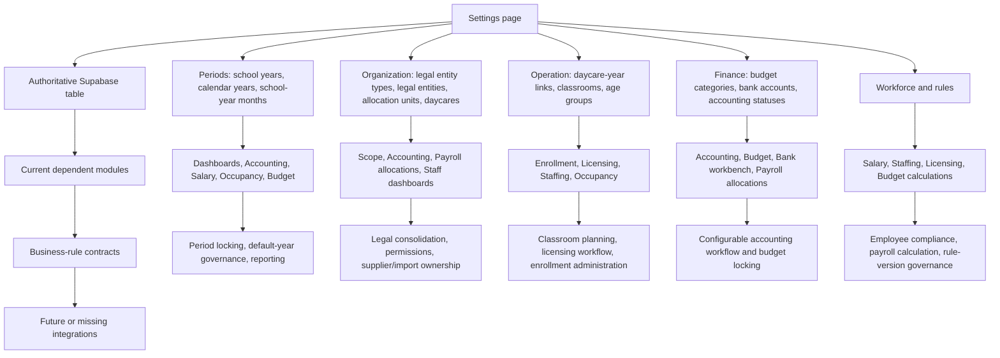

# TRACK 014C Settings Dependency Audit

Status: Audited 2026-07-24.

## Scope and method

This audit covers only the 22 editable groups in `#training/settings` and the rule data they expose. It traces Settings metadata to Supabase tables, foreign keys, current portal queries, calculation modules, Handbook/schema rules, and foreseeable modules already represented in the architecture.

Evidence priority:

1. Applied migration history and frozen data dictionary.
2. Current runtime consumers and tests.
3. Architecture and Handbook documentation.
4. Inferences, explicitly marked with confidence.

The read-only System Rules catalog is a consumer/documentation surface, not an editable Settings page.

## Dependency map



Canonical chain:

```text
Settings Page
    ↓
Supabase configuration table
    ↓
Current runtime consumers
    ↓
Database / Handbook / calculation rule
    ↓
Future module or missing integration
```

## Page-by-page dependency matrix

### Periods and years

| Settings page → table | Business purpose and field purpose | Current consumers | Not used but should be / relationship and rule findings |
|---|---|---|---|
| שנות לימודים → `school_years` | `display_name` labels the period; `school_year_code` is its stable integration identity; dates define coverage; `status` controls lifecycle; `is_selectable` controls UI availability. | Salary calculator, occupancy calculator, management dashboards, Budget rules, staffing parameters, daycare-year relationships. | `school_year_code` is not used by most UI flows but is required for imports and reconciliation. Runtime queries still request `is_default`, although the frozen migration does not define it and Settings does not expose it. A single authoritative default-year contract is missing. |
| שנים קלנדריות → `calendar_years` | Stable calendar reporting period: code, year number, label, dates, status, and selectability. | Accounting dashboard year selector. | Financial reports and bank imports should consistently validate transaction/reporting dates against an open/selectable calendar year. Current enforcement is mostly UI filtering. |
| חודשי שנת לימודים → `school_year_months` | Connects a school year to ordered reporting months; labels, reporting month, start/end dates, and sequence define the operational calendar. | Management dashboards, Budget calculations, staffing-parameter ranges, monthly work calendars. | Consumers mainly use `start_date` and sequence; `reporting_month` and `end_date` have weak runtime use. Missing rules: unique month per school year, contiguous sequence, no overlaps/gaps, and reporting month aligned to the month boundary. |

### Organization and daycares

| Settings page → table | Business purpose and field purpose | Current consumers | Not used but should be / relationship and rule findings |
|---|---|---|---|
| סוגי ישות משפטית → `legal_entity_types` | Stable classification for legal entities; name is human-facing, code is integration-facing, lifecycle preserves history. | Settings selector only. | Orphaned from current operational modules. It should drive legal/compliance reporting, entity-specific document requirements, and future supplier/contracts modules. |
| ישויות משפטיות → `legal_entities` | Represents the registered organization: display/legal names, type, registration number, stable code, lifecycle. | Settings relationships for allocation units, daycares, and bank accounts. | Current Accounting and finance dashboards do not consolidate by legal entity. Registration number and legal name are business-valid but unused at runtime; future statutory reporting should consume them. |
| יחידות ארגוניות → `allocation_units` | Authoritative flat allocation/reporting target. Type distinguishes daycare, office, management, development, and other units; legal entity supplies ownership; code is stable identity. | Portal scope, dashboards, bank allocations/workbench, payroll allocations, staff assignments, daycare linkage. | `legal_entity_id` is not selected by most consumers. Missing validation: a daycare’s chosen allocation unit must be type `DAYCARE`, unique, active, and owned by the same legal entity. Settings currently validates ownership but not type, uniqueness, or lifecycle. |
| מעונות → `daycares` | Stable daycare identity and license: name, legal owner, reporting unit, license, address, operating dates, code, lifecycle. | Dashboards, staff assignments, permissions, daycare-year operation, Budget scope, Accounting context. | License/address/open-close fields are not consumed by current licensing or compliance modules. Closing a daycare should prevent new operation years/assignments while preserving history; this cross-table rule is not centrally enforced in the UI. |

### Daycare and classroom operation

| Settings page → table | Business purpose and field purpose | Current consumers | Not used but should be / relationship and rule findings |
|---|---|---|---|
| הפעלת מעון בשנה → `daycare_school_years` | Declares whether a daycare operates in a school year and provides the parent identity used by classrooms. | Management dashboards, Budget calculations, classroom selectors. | Current dashboards query tuition/staffing calculation and standard fields that Settings does not expose and that are not present in the earliest frozen table definition. The source contract needs reconciliation before editing those fields. |
| כיתות → `classrooms` | School-year-bound classroom identity: parent daycare/year, name/code, mixed-class flag, effective dates, lifecycle. | Staff dashboard, employee assignments, enrollment, management occupancy/staffing. | The standalone occupancy calculator does not consume actual classroom area/configuration and remains scenario-based. Classroom age-group membership lives in `classroom_age_groups` but is outside Settings, so the classroom relationship is incomplete for real licensing. |
| קבוצות גיל → `age_groups` | Stable age taxonomy, display order, and lifecycle used to join enrollment and rules. | Occupancy calculator, Budget calculations, enrollment, licensing/staffing dashboards. | `classroom_licensing_rules.age_group` and `staffing_rules.age_group` use text codes rather than the `age_group_id` relationship. This duplicates taxonomy and permits drift. They should eventually reference the authoritative age group. |

### Finance and accounting

| Settings page → table | Business purpose and field purpose | Current consumers | Not used but should be / relationship and rule findings |
|---|---|---|---|
| סעיפי תקציב → `budget_categories` | Stable planning/reporting category: name/code, Handbook category type, lifecycle. | Budget calculations, finance dashboard, Accounting allocations, payroll allocations, bank workbench. | TRACK 014B briefly exposed obsolete pre-freeze values (`PAYROLL`, `OTHER`). TRACK 014C restores the frozen BR-0050 values. Missing governance: prevent archiving categories used by active rules or current allocations without replacement mapping. |
| חשבונות בנק → `bank_accounts` | Identifies a legal entity’s bank source using a stable code, display name, masked identifier, and lifecycle. | Accounting dashboard and bank workbench; bank transactions reference the account. | Consumers use display name/code but not legal owner or masked identifier. Future entity consolidation, import matching, and duplicate-account detection should consume those fields. |
| מצבי הנהלת חשבונות → `accounting_statuses` | Intended configurable presentation/order/finality for accounting workflow statuses. | Settings only. Accounting modules instead use hardcoded status codes and labels. | This is currently an orphaned duplicate of the constrained `bank_allocations.accounting_status` enum. Decide whether the table becomes presentation metadata for those exact codes or is retired; a free-standing editable status list must not invent values rejected by the database. |

### Workforce and rules

| Settings page → table | Business purpose and field purpose | Current consumers | Not used but should be / relationship and rule findings |
|---|---|---|---|
| תפקידים → `roles` | Stable employee/payroll role identity with lifecycle. | Staff dashboard, employee assignments, payroll allocations, Budget role logic. | Runtime consumers query `daycare_relevant` and `role_group`, but Settings exposes neither. Their allowed values and business rules are undocumented, so adding editors now would invent a contract. |
| תעודות והכשרות → `certificate_types` | Stable catalog of employee certificate/training types. | Settings only; employee certificate records can reference it at the database level. | Employee UI uses raw certificate/compliance fields instead of this catalog. It should drive employee compliance, expiry alerts, required-certificate-by-role rules, and reporting. |
| כללי רישוי כיתה → `classroom_licensing_rules` | Effective-dated square-metres-per-child, maximum capacity, mixed-age compatibility, rounding, and lifecycle by age group. | Occupancy calculator and licensing dashboards. | Settings omits `allowed_mixed_with`, although the calculator consumes it. Relationship to `age_groups` is a text code, not a foreign key. Missing validation: non-self mixed pairs, reciprocal compatibility, no overlapping active rules for the same age group, and approved rounding values. |
| כללי תקינה → `staffing_rules` | Intended effective staffing ratio/minimum by school year, standard, and age group. | No current runtime consumer found. Occupancy and Budget use staffing-shaped rows from `budget_rules` instead. | Orphaned and duplicated. Choose one authoritative staffing-rule source before integration. Until then, editing this table may have no product effect. |
| פרמטרי תקציב צוות → `staffing_budget_parameters` | Effective monthly FTE hours and hourly Budget cost by school year/month range. | Budget calculations, finance dashboard, occupancy model’s FTE context. | Missing overlap/uniqueness rule for active ranges in the same year. `budget_formula` is consumed but not exposed; it must remain an approved code, not arbitrary text, until its vocabulary is documented. |
| רכיבי תגמול → `compensation_factors` | Stable salary component with value type and lifecycle. | Salary calculator and compensation rules. | Complete primary relationship. Missing governance: value-type changes after use can reinterpret historical rules and should be blocked or versioned. |
| כללי תגמול ושכר → `compensation_rules` | Effective amount by component, optional school year, seniority range, paid-leave applicability, and lifecycle. | Salary calculator. | Runtime also queries `eligibility_condition` and `proration_method`, which Settings does not expose. Their controlled vocabularies are not documented. Missing validation: overlapping seniority/effective ranges for the same factor and year. |
| כללי תקציב → `budget_rules` | Compact effective-dated rule contract by category, year scope, organization/age scope, rule type, sources, and value. | Budget calculations, finance dashboard, occupancy calculator. | TRACK 014C restores the frozen rule types and source fields. Current calculations also consume later/imported fields such as `calculation_method`, parameters, standards, and rounding. The compact frozen contract and imported runtime extension need one documented adapter; editing both models directly would duplicate logic. |
| תעריפי נסיעות → `travel_rates` | Intended school-year daily travel rate and monthly cap with lifecycle. | No current consumer found. Salary travel currently comes from compensation factors/rules. | Orphaned and duplicated. Decide whether travel is a specialized compensation rule or a separate authoritative rate table; do not maintain both independently. |

## Field audit summary

Every field exposed by Settings has a plausible business purpose, but not every field has a current runtime consumer.

Confirmed runtime-orphaned Settings groups:

- `legal_entity_types`
- `accounting_statuses`
- `staffing_rules`
- `travel_rates`
- `certificate_types` at the UI/runtime level

Confirmed fields used as relationships or integration identity rather than calculations:

- Stable `*_code` fields.
- Legal names and registration numbers.
- Address, license, and masked bank identifiers.
- Lifecycle fields on master data.

Confirmed consumer fields missing from Settings:

- `classroom_licensing_rules.allowed_mixed_with`
- `roles.daycare_relevant`
- `roles.role_group`
- `compensation_rules.eligibility_condition`
- `compensation_rules.proration_method`
- `staffing_budget_parameters.budget_formula`
- Imported Budget-rule extension fields used by current calculations
- Classroom-to-age-group membership

These were not added because their value contracts or editing semantics are incomplete; adding uncontrolled inputs would create new invalid business logic.

## Relationship completeness

Complete in the current Settings workflow:

- Legal entity type → legal entity.
- Legal entity → allocation unit.
- Legal entity + allocation unit → daycare, with same-owner client validation.
- School year + daycare → daycare-school-year.
- Daycare-school-year → classroom.
- School year → effective staffing-parameter months.
- Compensation factor → compensation rule.
- Budget category/year/scope dimensions → Budget rule.

Incomplete or weak:

- Age-code text in licensing/staffing rules duplicates `age_groups`.
- Classroom age groups are not editable with the classroom.
- Accounting status metadata is not linked to the constrained allocation status code.
- Legal entity ownership is not used by downstream financial consolidation.
- Daycare allocation-unit type, uniqueness, active-state, and ownership need one database-level invariant.
- Rule range overlap and precedence are not consistently validated.

## Duplicated business logic

1. Staffing requirements exist in both `staffing_rules` and staffing-shaped `budget_rules`.
2. Travel exists in `travel_rates` and compensation factors/rules.
3. Accounting statuses exist in `accounting_statuses` while Accounting uses hardcoded enum labels.
4. Age taxonomy exists in `age_groups` and text age codes inside rule tables.
5. Default school year is queried as `is_default` while the frozen period schema documents selectability/status rather than a default flag.
6. Budget has a compact frozen contract plus imported calculation-method/parameter extensions consumed directly by calculators.

## Missing business rules and validations

High priority:

- Single source and precedence for staffing rules.
- Single source for travel compensation.
- Exact contract connecting `accounting_statuses` to bank-allocation status codes.
- Budget rule validation by rule type and required year scope.
- No overlapping active effective ranges for licensing, staffing, compensation, travel, or staffing-Budget parameters.
- Stable codes immutable after first use.
- Lifecycle transitions must not orphan active dependent records.

Medium priority:

- School-year month continuity and month-boundary validation.
- One authoritative default/current school-year selection rule.
- Daycare allocation unit must be active, type `DAYCARE`, unique, and owned by the same legal entity.
- Reciprocal and non-self mixed-age compatibility.
- Calendar-year open/closed enforcement for accounting periods.
- Role-to-required-certificate policy.

## Narrow correction implemented in TRACK 014C

The Budget category and Budget rule dropdowns introduced in TRACK 014B matched the original table-creation migration but not the later Schema Freeze corrective migration. TRACK 014C corrects only this clearly invalid mismatch:

- Budget category values are restored to `INCOME`, `EXPENSE`, `INTERNAL_OFFSET`, and `MANUAL_UNDEFINED`.
- Budget rule types are restored to `FORMULA_BASED`, `FIXED_AMOUNT`, `MANUAL`, and `EXTERNAL_SOURCE`.
- Calendar-year scope, calculation source, and actual-performance source are exposed.
- Validation now enforces a school/calendar-year scope and the rule-type-specific value contract.

No Budget Engine calculation, operational API contract, Google Sheets structure, or database schema was changed.
