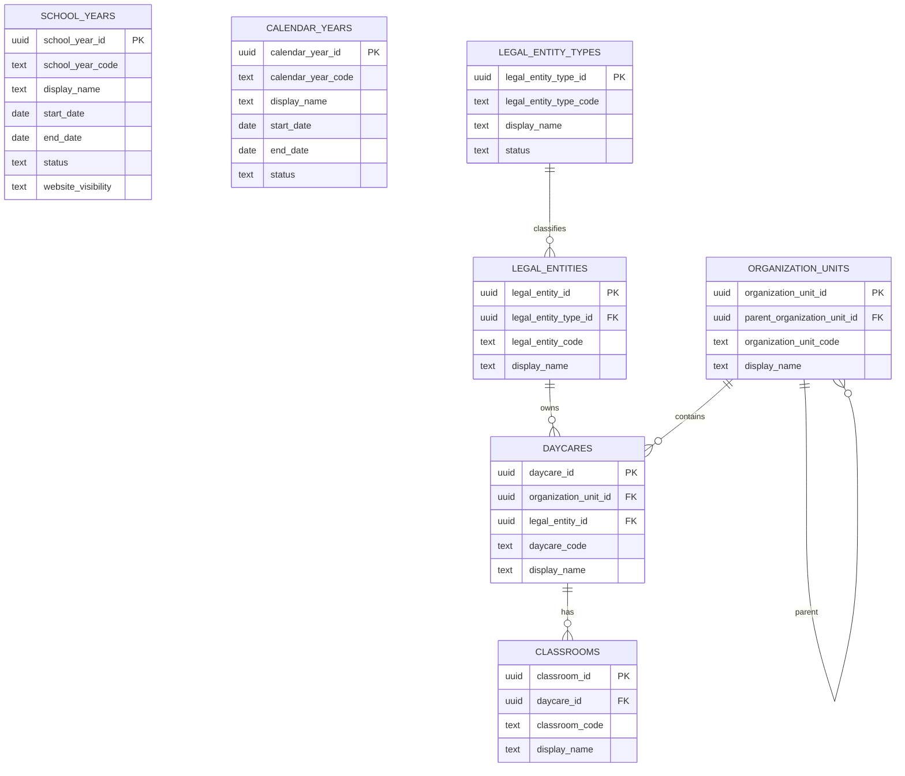

# Draft ERD

Status: Draft architecture diagram.

Last updated: 2026-07-12

## Purpose

This diagram shows the current database blueprint at concept level. The database is not implemented.

## Notes

- Only `school_years` and `calendar_years` are approved concepts.
- `legal_entity_types` is draft.
- Other entities shown are planned or not yet designed.

