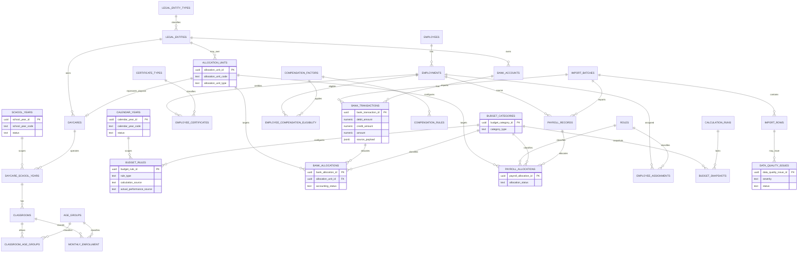

# Schema Freeze v1 ERD

Status: Schema Freeze v1 diagram.

Last updated: 2026-07-13

## Purpose

This diagram shows the kept database structure after Migration 011 corrections.

## Notes

- `allocation_units` is flat in v1.
- No `organization_units` hierarchy is required in v1.
- `allocation_unit_id` is authoritative for bank and payroll allocations.
- Dynamic budget results are not stored until explicit lock creates immutable `budget_snapshots`.
