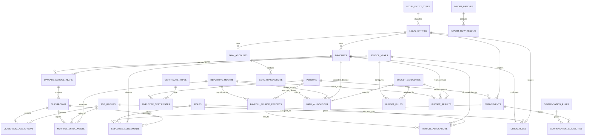

# Database Blueprint ERD

Status: Draft v1 architecture, ready for design review.

Last updated: 2026-07-12

## Purpose

This ERD shows the compact target data model. It is a blueprint, not an implemented schema. Google Sheets remains the operational editing interface; the database is the final system Source of Truth.

## Core Business ERD

## Key Entity Fields

```mermaid
erDiagram
  SCHOOL_YEARS {
    uuid school_year_id PK
    text school_year_code UK
    text display_name
    date start_date
    date end_date
    text lifecycle_status
    boolean is_selectable
  }

  REPORTING_MONTHS {
    uuid reporting_month_id PK
    date month_start UK
    uuid calendar_year_id FK
    uuid school_year_id FK
    text lifecycle_status
  }

  LEGAL_ENTITIES {
    uuid legal_entity_id PK
    text legal_entity_code UK
    text display_name
    text registration_number
    text lifecycle_status
  }

  DAYCARES {
    uuid daycare_id PK
    text daycare_code UK
    text display_name
    text license_number
    uuid legal_entity_id FK
    text lifecycle_status
  }

  DAYCARE_SCHOOL_YEARS {
    uuid daycare_school_year_id PK
    uuid daycare_id FK
    uuid school_year_id FK
    boolean is_operating
  }

  CLASSROOMS {
    uuid classroom_id PK
    uuid daycare_school_year_id FK
    text classroom_code
    text display_name
    date effective_from
    date effective_to
    text lifecycle_status
  }

  AGE_GROUPS {
    uuid age_group_id PK
    text age_group_code UK
    text display_name
  }

  MONTHLY_ENROLLMENTS {
    uuid monthly_enrollment_id PK
    uuid classroom_id FK
    uuid reporting_month_id FK
    uuid age_group_id FK
    int children_count
    text sync_status
  }

  PERSONS {
    uuid person_id PK
    text national_id UK
    text employee_code UK
    text display_name
    date birth_date
  }

  EMPLOYMENTS {
    uuid employment_id PK
    uuid person_id FK
    uuid legal_entity_id FK
    date employment_start
    date employment_end
    numeric recognized_seniority
    text employment_status
  }

  EMPLOYEE_ASSIGNMENTS {
    uuid assignment_id PK
    uuid employment_id FK
    uuid role_id FK
    uuid daycare_id FK
    uuid classroom_id FK
    date effective_from
    date effective_to
  }

  PAYROLL_SOURCE_RECORDS {
    uuid payroll_source_record_id PK
    uuid reporting_month_id FK
    uuid person_id FK
    text source_record_key
    numeric employer_cost
    numeric total_hours
  }

  PAYROLL_ALLOCATIONS {
    uuid payroll_allocation_id PK
    uuid payroll_source_record_id FK
    uuid daycare_id FK
    uuid role_id FK
    numeric allocated_cost
    numeric allocated_hours
  }

  BANK_ACCOUNTS {
    uuid bank_account_id PK
    uuid legal_entity_id FK
    text bank_account_code UK
    text display_name
    text lifecycle_status
  }

  BANK_TRANSACTIONS {
    uuid bank_transaction_id PK
    uuid bank_account_id FK
    date transaction_date
    text source_transaction_key
    numeric debit_amount
    numeric credit_amount
  }

  BANK_ALLOCATIONS {
    uuid bank_allocation_id PK
    uuid bank_transaction_id FK
    uuid reporting_month_id FK
    uuid daycare_id FK
    uuid budget_category_id FK
    text action_type
    numeric allocation_amount
    text accounting_status
  }

  BUDGET_CATEGORIES {
    uuid budget_category_id PK
    text budget_category_code UK
    text display_name
    text category_type
    text lifecycle_status
  }

  BUDGET_RULES {
    uuid budget_rule_id PK
    uuid budget_category_id FK
    uuid school_year_id FK
    text calculation_method
    date effective_from
    date effective_to
  }

  BUDGET_RESULTS {
    uuid budget_result_id PK
    uuid reporting_month_id FK
    uuid daycare_id FK
    uuid budget_category_id FK
    numeric planned_amount
    numeric actual_amount
    text result_status
  }
```

## Compact Google Sheets View

The user-facing Google Sheets workspace does **not** mirror this ERD. The preferred visible tabs are:

1. `הגדרות`
2. `מעונות וכיתות`
3. `ילדים`
4. `עובדים`
5. `שכר`
6. `בנקים`
7. `תקציב` only if manual budget inputs are confirmed

A visible row may synchronize into more than one database table. IDs, audit records, import batches, relationship tables and history remain hidden from daily users.

## Design Boundaries

- No generic organization hierarchy is required for v1.
- No microservices, event bus, multi-tenant or multi-country model.
- Small controlled status sets may remain code/check constraints rather than separate lookup tables.
- `Budget Results` are stored only where persistence, locking or performance justifies them; otherwise calculations may remain views/services.
- Legal Entity ownership history is implemented only when required for a real Daycare transfer, while preserving a migration path.

## Open Review Items

- Confirm whether `daycare_school_years` carries additional annual operating fields or remains a minimal bridge.
- Confirm the exact visible Budget tab requirement.
- Confirm payroll stable source key and whether National ID is always available.
- Confirm whether bank accounting status history requires a separate event table in v1 or can be covered by the shared audit model plus completion timestamps.
